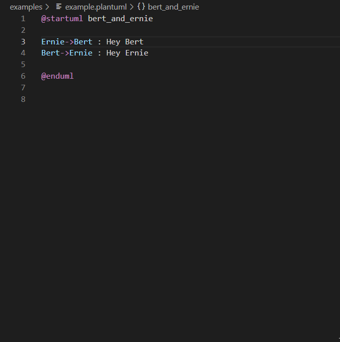
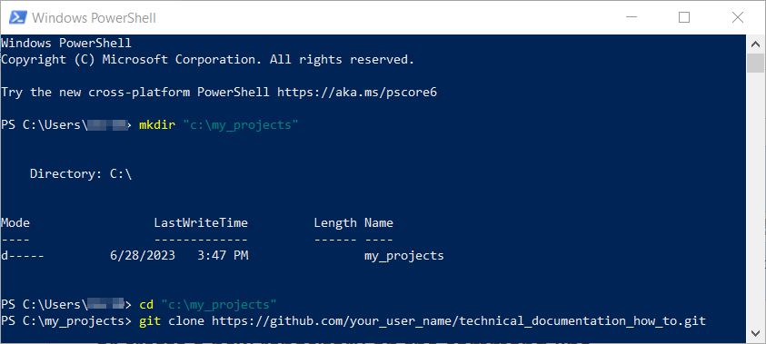
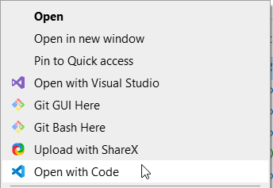

# Usage

This chapter will give you instructions on how to use the described tools. You are reading a static generated site. This is OK for now to get you started. For the next part we will start using Git to download the repository that will generate a dynamic site 

## Create a PlantUML picture

- In `VS Code` create a new file with an extension of one of the following `.wsd,.pu,.puml,.plantuml,.iuml`
- Add the following syntax to that file:
  ```
  @startuml bert_and_ernie

  Ernie->Bert : Hey Bert
  Bert->Ernie : Hey Ernie

  @enduml
  ```
- position your cursor between the `@...uml` tags and press `ALT`+`D` or do a RMK (Right Mouse Click) to see what other options you have.

   

- a preview window on the right should open, showing a sequence diagram showing Bert and Ernie talking
  
  ```
  @startuml bert_and_ernie
  
  skinparam backgroundColor transparent
  Ernie->Bert : Hey Bert
  Bert->Ernie : Hey Ernie

  @enduml
  ```
 - read up on Sequence diagrams, State diagrams, Activity diagrams!

 ## Git Clone

By cloning a Git repository (repo) you will create a local (on your computer) Git repository from somewhere else. This repository then contains all the code and commits (history). Depending on how a project is structured -by this I mean the conventions of working together- you want to inform the original repository that you have changes.

More exact info will follow on a way that this process _can_ work. But for starters you have to do the following to obtain a local copy of the repo:

- Create a [Github account](https://github.com/signup?)
- Log into your account and go to the user you want to clone a repository from (for this example, use the [this documentation tutorial](https://github.com/luminize/technical_documentation_how_to))
- In github, clone the repository to your own github account by using the `Fork` button.
- Open Powershell or any other console.
- Create/move to a directory in which you want to have this repository.
- Clone the repository locally by 
  ```
  git clone https://github.com/your_user_name/technical_documentation_how_to.git
  ```
  
- cd into the newly created directory, and open the directory with `VS Code` or open the folder from within `VS Code`
  
  or

  