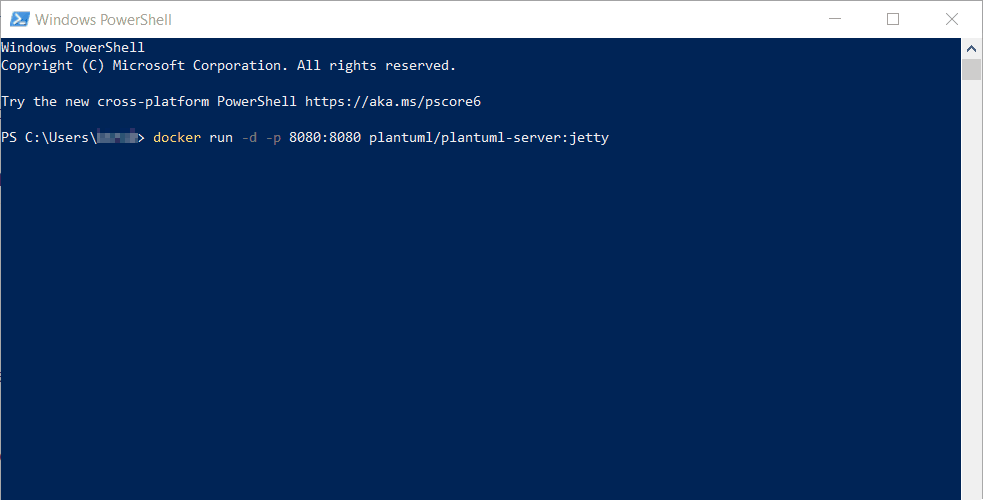

# PlantUML server

Follow these instructions to install the PlantUML docker container. Using a container allows ease of running a local server. This way you do not need to have access to the Internet in case you are working in a factory where access to the Internet is limited or unavailable.

- Pull (Download) the PlantUML server container by starting it with:
  ```
  docker run -d -p 8080:8080 plantuml/plantuml-server:jetty
  ```
  
- Allow Windows firewall to use port 8080
  
- In Docker Desktop you can now see the container running. As per the startup arguments it has connected port 8080 of the container to port 8080 of our computer.
  
- Browse to the adress [http://localhost:8080](http://localhost:8080) to use PlantUML server. 

If you have trouble accessing the container due to possibly other servers using the localhost 8080 port, please connect the container port `8080` to another local port like `8181` like so:
- When starting from the command line use the following startup command:
  ```
  docker run -d -p 8181:8080 plantuml/plantuml-server:jetty
  ```
- Or start the container from Docker desktop by choosing `Images -> plantuml/plantuml-server`, press the `run` button in the top right corner and change the port like so:

  
- Browse to the adress [http://localhost:8181](http://localhost:8181) to use PlantUML server.