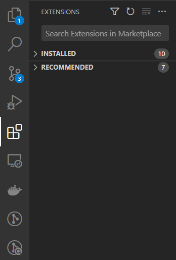

# Visual Studio Code

For writing the documentation we'll use Microsoft's Visual Studio Code. This is an IDE with various plug-ins that will help with the writing process.
Because we're not hindered by word processor software like Microsoft Word we can focus on the content and because we write in plain text, we can use Git for revisions, merging work by multiple authors, and have it displayed (rendered) in various tools.

- Download and install [Microsoft Visual Studio Code](https://code.visualstudio.com/).
- Open Microsoft Visual Studio Code (from now on abbreviated as `VS Code`).
- Open the `Extensions` tab on the left and search for packages that will help with the workflow.
 
  
- Install `PlantUML`
  
  

- Install `GitLens`

  

- Install `Markdown All in One`
  
  

# Setup of PlantUML extension

Instead of using the demo webserver of the PlantUML organisation, the PlantUML extension can use a local server. This can only be done if you have correctly [installed Docker](Docker.md) and also [installed the PlantUML server container](PlantUMLserver.md) (O r if you're a PRO installed the PlantUML server in your own way.)

- in `VS Code` open the settingd by `CRTL` + `,`
- search for `plantuml` in the search box
  
  

- Choose `PlantUMLServer` for renderer.
- Change the URL of the server to the correct adress of the PlantUML server docker container.

Try [making a very simple diagram ](../usage/PlantUML.md#create-a-plantuml-diagram)
